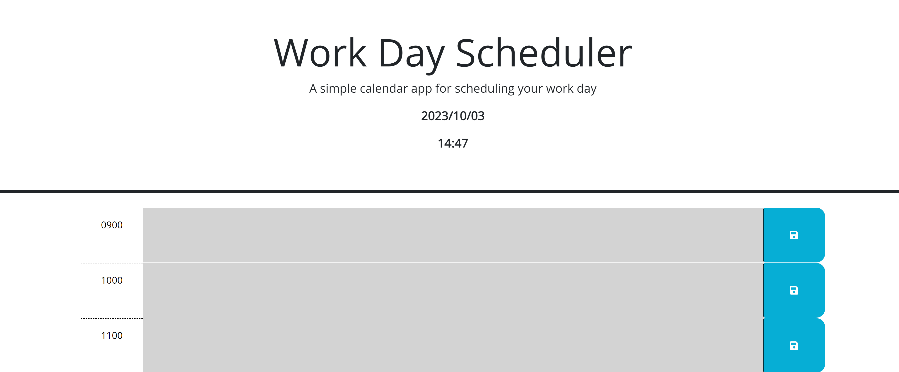
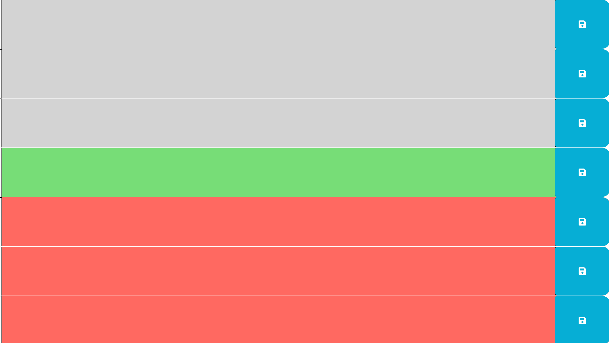
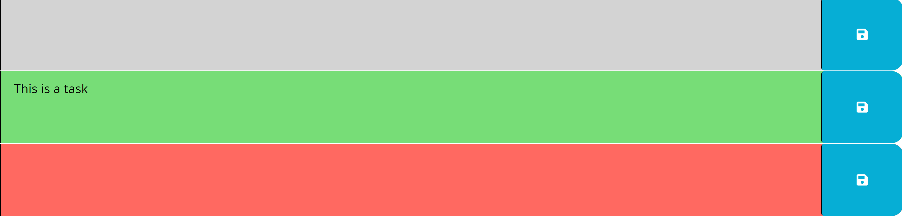

# WorkDay-Planner

## Description:
This workday planner allows a user to input a task at a designated time block while allowing the user to see past present and future tasks based on a color order

## Installation:
This project requires no installation of additional technologies for the user to navigate the program

## Usage: 

### Upon Loading in the user will see the date and time of date

### The User will see the urrent hour block as highlighted green, past blocks as gray, and future blocks as red.

### The User has the ability to type inputs and save them on the page

